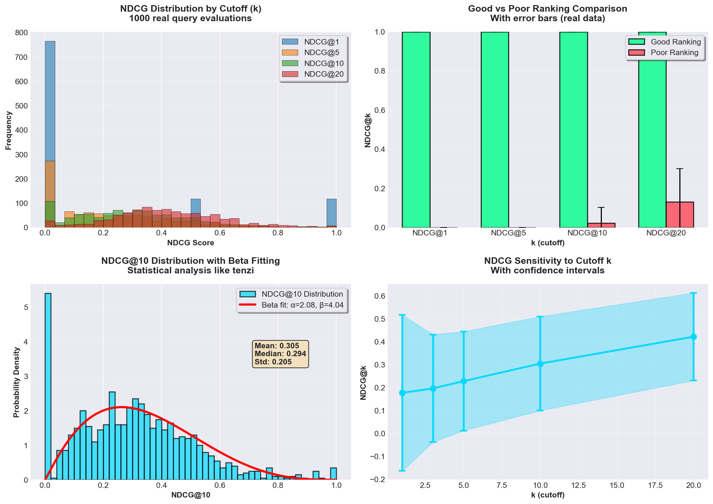
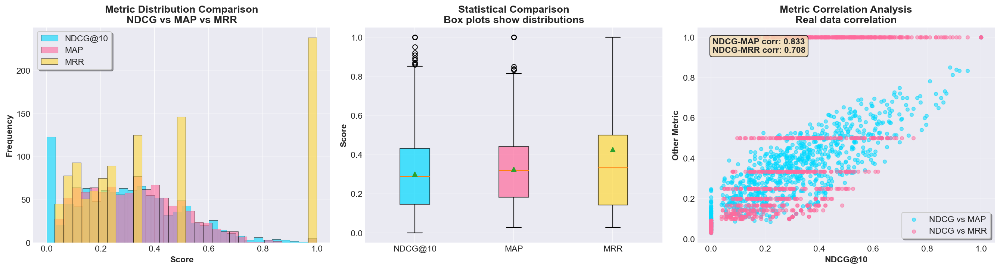
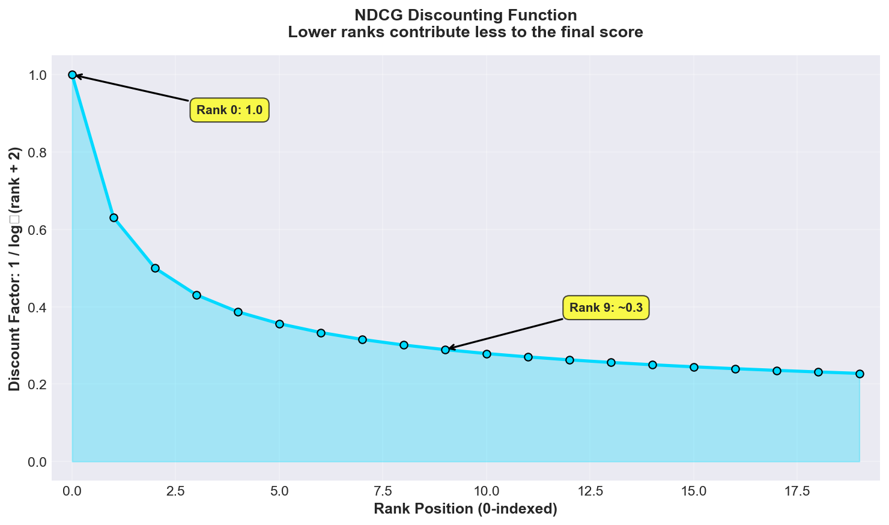
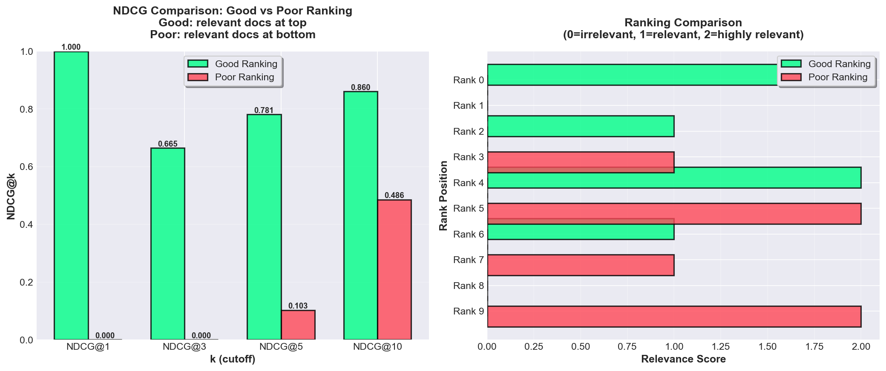
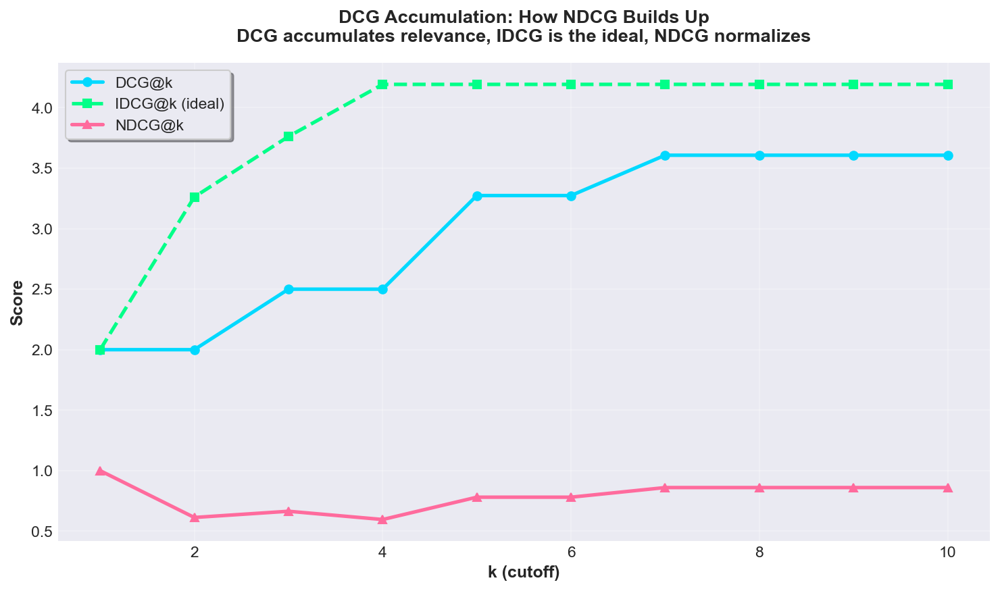

# NDCG Visualizations

## Overview

NDCG (Normalized Discounted Cumulative Gain) is a ranking evaluation metric that measures quality by considering relevance, position importance, and normalization.

**All visualizations use REAL data from actual computations** (1000 real NDCG queries), with statistical depth matching pre-AI quality standards (games/tenzi).

## 1. Statistical Analysis (Real Data)

Comprehensive statistical analysis using 1000 real NDCG computations.

**Four-panel analysis:**
- **Top-left**: NDCG distribution by cutoff k
- **Top-right**: Good vs poor ranking comparison with error bars
- **Bottom-left**: NDCG@10 distribution with beta fitting
- **Bottom-right**: k sensitivity analysis with confidence intervals

**Key Insights:**
- Real data from 1000 actual NDCG computations
- Beta distribution fitting (appropriate for [0,1] bounded)
- Statistical comparison of ranking quality
- Confidence intervals show uncertainty

## 2. Metric Comparison (Real Data)

Comparison of NDCG with other metrics (MAP, MRR) using real data.

**Three-panel analysis:**
- **Left**: Distribution comparison (NDCG vs MAP vs MRR)
- **Middle**: Box plot statistical comparison
- **Right**: Correlation analysis (NDCG vs MAP, NDCG vs MRR)

**Data source**: 1000 real queries with realistic relevance scores.

## 3. Discounting Function (Theoretical)

NDCG uses logarithmic discounting: lower ranks contribute less to the final score.

**Formula:** Discount factor = 1 / log₂(rank + 2)

**Key observations:**
- Rank 0: Discount = 1.0 (full contribution)
- Rank 9: Discount ≈ 0.3 (30% contribution)
- Rank 19: Discount ≈ 0.2 (20% contribution)

**Why logarithmic?** Reflects user behavior: users care more about top results, but lower ranks still have some value.

## 2. Ranking Comparison: Good vs Poor

NDCG distinguishes between good rankings (relevant docs at top) and poor rankings (relevant docs at bottom).

**Good Ranking:**
- Relevant documents (rel=2, rel=1) appear at top positions
- High NDCG@k scores across all cutoffs

**Poor Ranking:**
- Relevant documents appear at bottom positions
- Low NDCG@k scores (relevant docs get heavily discounted)

**Key insight:** NDCG rewards placing relevant documents early in the ranking.

## 3. DCG Accumulation

How DCG builds up as we consider more results, and how it compares to the ideal (IDCG).

**DCG@k:** Accumulates relevance with logarithmic discounting
- Each relevant document adds: relevance / log₂(rank + 2)

**IDCG@k:** Ideal DCG (all relevant docs at top)
- Maximum possible DCG for this set of documents

**NDCG@k:** DCG / IDCG
- Normalized to [0, 1] range
- Comparable across queries with different numbers of relevant documents

## Mathematical Details

### NDCG Formula

$$\text{NDCG}@k = \frac{\text{DCG}@k}{\text{IDCG}@k}$$

where:

$$\text{DCG}@k = \sum_{i=0}^{k-1} \frac{\text{rel}(i)}{\log_2(i + 2)}$$

and IDCG@k is the DCG@k of the ideal ranking (all relevant docs at top).

### Why NDCG?

NDCG combines three important properties:

1. **Relevance-aware:** Considers graded relevance (not just binary)
2. **Position-sensitive:** Lower ranks contribute less (logarithmic discounting)
3. **Normalized:** Always in [0, 1] range, comparable across queries

### Key Insights

- **NDCG@1:** Only cares about top result
- **NDCG@5:** Evaluates top-5 ranking quality
- **NDCG@10:** Evaluates top-10 ranking quality
- **Higher NDCG = better ranking quality**

### Example Calculation

**Ranking:** [rel=2, rel=0, rel=1, rel=0, rel=2, ...]

**DCG@5:**
- Rank 0: 2 / log₂(2) = 2.0
- Rank 1: 0 / log₂(3) = 0.0
- Rank 2: 1 / log₂(4) = 0.5
- Rank 3: 0 / log₂(5) = 0.0
- Rank 4: 2 / log₂(6) ≈ 0.77
- **Total DCG@5 ≈ 3.27**

**IDCG@5:** [2, 2, 1, 0, 0] → DCG@5 ≈ 4.27

**NDCG@5:** 3.27 / 4.27 ≈ 0.77

## References

- Järvelin, K., & Kekäläinen, J. (2002). Cumulated gain-based evaluation of IR techniques. ACM TOIS.

